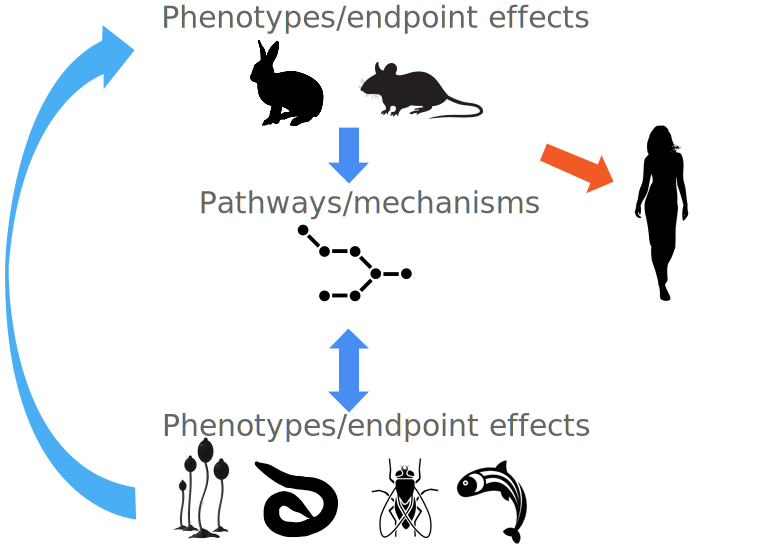

<pre>

┏━━━┳━━━┳━━━┳━━━━┓╋╋╋╋┏┓┏┓
┗┓┏┓┃┏━┓┃┏━┓┃┏┓┏┓┃╋╋╋┏┛┗┫┃
╋┃┃┃┃┃╋┃┃┗━┛┣┛┃┃┣┻━┳━┻┓┏┫┗━┳━━┓
╋┃┃┃┃┗━┛┃┏┓┏┛╋┃┃┃┏┓┃┏┓┃┃┃┏┓┃━━┫
┏┛┗┛┃┏━┓┃┃┃┗┓╋┃┃┃┗┛┃┏┓┃┗┫┃┃┣━━┃
┗━━━┻┛╋┗┻┛┗━┛╋┗┛┃┏━┻┛┗┻━┻┛┗┻━━┛
╋╋╋╋╋╋╋╋╋╋╋╋╋╋╋╋┃┃
╋╋╋╋╋╋╋╋╋╋╋╋╋╋╋╋┗┛

</pre>

This repository contains the source code for the DARTpaths application. See [https://www.vivaltes.com/dartpaths/](https://www.vivaltes.com/dartpaths/) for more details. More code related to DARTpaths and Xpaths can be found at [https://github.com/Xpaths](https://github.com/Xpaths).




# R package and Shiny application

This repository contains the `dartTools` R package (which includes the Shiny app) and some example ETL scripts for populating the database. Most data must be obtained from third-party data sources (see below). The app requires R, python>=3.6 and various R and python packages. Notably, it requires RDKit which can be challenging to install. There are various ways to set up the environment and run the Shiny app, two of which are described below. Note that the application requires a pre-populated database.

## Dockerized version of the app

You can use the Dockerfile in the root of the repository

```{bash}
# (re)build the image
sudo docker build -t dartpaths .

# start a container using this image
# after this, you can open the app in your web browser: 127.0.0.1:3838
sudo docker run --rm -it -p3838:3838 dartpaths
```

## Local installation

RDKit can be installed from source or using conda. See below some example code for setting up miniconda and creating an environment with rdkit.

```{bash}
# install miniconda
wget https://repo.anaconda.com/miniconda/Miniconda3-latest-Linux-x86_64.sh
bash Miniconda3-latest-Linux-x86_64.sh
conda config --set auto_activate_base false # you probably don't want to auto activate conda with each new terminal session

# create an rdkit conda environment
# run this in a new terminal, such that the conda command is available
RDKIT_VERSION="2022.03.1"
PYTHON_CONDA_ENV="rdkit"
conda create -y -n $PYTHON_CONDA_ENV -c conda-forge -c openbabel -c rdkit python=3.9 rdkit=$RDKIT_VERSION openbabel
conda run -n $PYTHON_CONDA_ENV pip install urllib3 wget scipy pebble statsmodels "pandas<1.4"
```

Run the code:
```{r}
dartpathsGitDir <- "~/git/dartpaths/"
dumpdir <- file.path(dartpathsGitDir,"ETL/data_app/txt_database_dump")

# install the package:
install.packages(file.path(dartpathsGitDir,"dartTools"), repos = NULL)

# to load the package:
library(dartTools)
# to load without installing (while developing)
devtools::load_all(file.path(dartpathsGitDir,"dartTools"))

# load the database (requires an already populated dump directory)
options("dartpaths_smilescache" =  file.path(dartpathsGitDir,"ETL/data_app/smilesCache.txt"))
options("dartpaths_default_dumppath" = dumpdir)
options("dartpaths_python" = "~/miniconda3/envs/rdkit/bin/python")
database <- DartDB$new()
database$loadDump(dumpdir)
database$inspect()

# run the app
runDart()
```

# Database

The DARTpaths application makes use of its own internal database. Currently, this is a collection of R data.table objects (tab-separated files are used for database persistence). The database can be populated with data from various sources. Some data sources do not allow redistribution and other may require a license for e.g., non-academic usage. Therefore, users are encouraged to create their own scripts for extraction, transformation and loading (ETL) of data. In that way they can ensure that the imported data fits their needs and licenses. Moreover, it allows them to add non-public data from in-house academic or enterprise sources or external commercial data vendors. For a number of public data sets (see table), example ETL script are shared under ETL/etl_scripts/. For some of the sources, a manual download (after registration of confirmation of terms and conditions) is required.

| Data source | Data type  | Terms and conditions | Download |
|:--|:--|:--|:--|
| [Concawe](https://www.concawe.eu)          | Substance categories                                     | (not specified)                                                                                           |  See example scripts                                   |
| [Dictybase](http://dictybase.org)            | Mutant phenoytpes                                        | (not specified)                                                                                           |  See example scripts                                   |
| [ECHA](https://echa.europa.eu/)         | Substances                                               | [ECHA legal notice](https://echa.europa.eu/nl/legal-notice)                                                                    | Manual download (after confirming T&C) |
| [ECHA](https://echa.europa.eu/)         | Classification, Labelling and Packaging (CLP) regulation | [ECHA legal notice](https://echa.europa.eu/nl/legal-notice)                                                                    | Manual download (after confirming T&C)|
| [Ensembl](https://www.ensembl.org)         | Orthology data (cross-species homologous genes)          | https://www.ebi.ac.uk/about/terms-of-use/                                                                 |  See example scripts                                   |
| [EPA CompTox](https://comptox.epa.gov)         | Substances                                               | [CompTox terms and conditions](https://comptox.epa.gov/dashboard/about)                                                                   |  See example scripts                                   |
| [EPA CompTox](https://comptox.epa.gov)         | In vitro cell assays                                     | [CompTox terms and conditions](https://comptox.epa.gov/dashboard/about)                                                                   |  See example scripts                                   |
| [FlyBase](https://flybase.org/)            | Genotype-phenotype associations                          | [FlyBase terms and conditions](https://wiki.flybase.org/wiki/FlyBase:About#FlyBase_Copyright)                                             |  See example scripts                                   |
| [International Mouse Phenotyping Consortium](https://www.mousephenotype.org)  | Genotype-phenotype associations                          | [IMPC terms and conditions](https://www.mousephenotype.org/about-impc/terms-of-use)                                                    |  See example scripts                                   |
| [LOA-Reach consortium](https://loa-reach.com/)          | Substance categories                                     | (not specified)                                                                                           | Shared in dartpaths repository                              |
| [MGI](http://www.informatics.jax.org/) | Genotype-phenotype associations                          | [MGI terms and conditions](http://www.informatics.jax.org/mgihome/other/copyright.shtml)                                              |  See example scripts                                   |
| [OBO](http://obofoundry.org)           | Ontologies                                               | [List of licenses for individual ontologies](http://obofoundry.org)                                            |  See example scripts                                   |
| [OECD QSAR Toolbox](https://qsartoolbox.org)        | In vivo substance activity (regulatory studies)          | [OECD terms and conditions](http://www.oecd.org/termsandconditions) <br> [ECHA legal notice](https://echa.europa.eu/nl/legal-notice)                           | Manual download (after registration)|
| [Reactome](https://reactome.org/)           | Biological pathways                                      | [Reactome license](https://reactome.org/license)                                                                              |  See example scripts                                   |
| [Reactome](https://reactome.org/)           | Mapping from Ensembl genes to Reactome pathways          | [Reactome license](https://reactome.org/license)                                                                              |  See example scripts                                   |
| [Wormbase](https://wormbase.org/)            | Phenotypes observed after exposure to substance          | [Wormbase terms and conditions](https://wormbase.org/about/policies)                                                                       |  See example scripts                                   |
| [ZFIN](https://wiki.zfin.org)           | Substances                                               | [ZFIN terms and conditions](https://wiki.zfin.org/display/general/WARRANTY+AND+LIABILITY+DISCLAIMER%2C+OWNERSHIP%2C+AND+LIMITS+ON+USE) |  See example scripts                                   |
| [ZFIN](https://wiki.zfin.org)           | Phenotypes observed after exposure to substance          | [ZFIN terms and conditions](https://wiki.zfin.org/display/general/WARRANTY+AND+LIABILITY+DISCLAIMER%2C+OWNERSHIP%2C+AND+LIMITS+ON+USE) |  See example scripts                                   |
| Dartpaths repository                     | Mammalian phenotypes extracted from literature (demo)    | Apache 2.0 license                                                                                        | Shared in dartpaths repository                              |
| Dartpaths repository                     | Fine-grained orthology additions (demo)                  | Apache 2.0 license                                                                                        | Shared in dartpaths repository                              |


## Example ETL scripts

The ETL scripts assume the following directory structure:

```text
dartpaths/
└── ETL/
    ├── etl_scripts
    │   └── qsar_toolbox
    ├── data_shared
    ├── data_manual_download
    ├── data_raw
    ├── data_intermediate
    ├── data_app/
        └── txt_database_dump
```

The `data_shared` directory contains a few data files that are shared with the source code. The `etl_scripts` directory contains a number of example scripts that are called by the main script `ETL/etl_scripts/populate_db_00_main.R`. Running this script without any alterations requires that various data files need to be manually added to the `data_manual_download` directory. All other directories will be created and populated by the scripts. The application itself only requires the database txt dump directory `ETL/data_app/txt_database_dump` that is created at the end of the ETL process. The data_raw and data_intermediate are not needed, but can be useful for recovery of failed ETL runs or debugging purposes. Make sure to read the following sections before running the example scripts. Although the scripts are written such that they can be executed by running the main script, it is often needed to manually execute the individual scripts. URLs and file formats of external sources tend to change over time, which requires adjustments of the corresponding ETL scripts.

## OECD QSAR Toolbox

The [OECD QSAR Toolbox](https://qsartoolbox.org/) provides a rich collection of data collected from OECD, ECHA and other sources. The toolbox itself only supports Windows as an operation system and is therefore not compatible with the primary setup of DARTpaths. However, it is possible to run the underlying PostgreSQL database independently in a platform-independent way. An example script `ETL/etl_scripts/qsar_toolbox/run_dockerized_qsardb.sh` is available that starts a Dockerized version of the PostgreSQL database. Before running this script, the user has to download the Toolbox from the original website (requires registration) and extract the `Toolbox<VERSION>.backup` file from the zip. The `ETL/etl_scripts/populate_db_01_qsartoolbox.R` script (called by the `ETL/etl_scripts/populate_db_00_main.R` script) can be used to query the qsartoolbox for DARTpaths-relevant data and add that to the DARTpaths database. After this step, the PostgreSQL instance can be stopped.

## Pathway to phenotype mapping

Currently, the pathway-to-phenotype mapping is pre-calculated as part of the ETL process. The `ETL/etl_scripts/populate_db_08_phenotype_enrichment.R` script (called by the `ETL/etl_scripts/populate_db_00_main.R` script) loops over relevant pathways and call the `ETL/etl_scripts/phenotype_enrichment.py` python module to calculate the mapping. The results are added to the database. Note that the python module creates and populates its own database. As a consequence, some data from public data sources are downloaded twice  (once as part of the core ETL and once as part of the python logic).

# Citation

If you are using this software in your publications, please cite it using the following reference: (TODO)

# Contributors

The following people contributed to the DARTpaths project or the DARTpaths application:

* Catherine Vickers (NC3Rs)
* Cyrille Krul (HU University of Applied Sciences)
* Diksha Bhalla (KU Leuven)
* Eefje Poppelaars (Vivaltes)
* Elisabeth Dévière (Open Analytics)
* Jan-Willem Lankhaar (HU University of Applied Sciences)
* Jens van Erp (KU Leuven)
* Lotte van Rijnberk (Vivaltes)
* Luke Noothout (CLEVER°FRANKE)
* Machteld Varewyck (Open Analytics)
* Marc Teunis (HU University of Applied Sciences)
* Marie Corradi (HU University of Applied Sciences)
* Marijke van Moerbeke (Open Analytics)
* Marjolein Wildwater (Vivaltes)
* Martijn Rooseboom (Shell)
* Marvin Steijaert (Open Analytics)
* Miguel Cisneiros (KU Leuven)
* Monique van der Voet (Vivaltes)
* Nadha Sholiha (KU Leuven)
* Raymond Pieters (HU University of Applied Sciences)
* Richard Curie (Syngenta)
* Tobias Verbeke (Open Analytics)
* Vera van Noort (KU Leuven)
* Wilco Tomassen (CLEVER°FRANKE)	

# License

Copyright 2018-2022 Open Analytics, Vivaltes and KU Leuven

Licensed under the Apache License, Version 2.0 (the "License");
you may not use the code and data in this repository except in compliance with the License.
You may obtain a copy of the License at

http://www.apache.org/licenses/LICENSE-2.0

Unless required by applicable law or agreed to in writing, software
distributed under the License is distributed on an "AS IS" BASIS,
WITHOUT WARRANTIES OR CONDITIONS OF ANY KIND, either express or implied.
See the License for the specific language governing permissions and
limitations under the License.